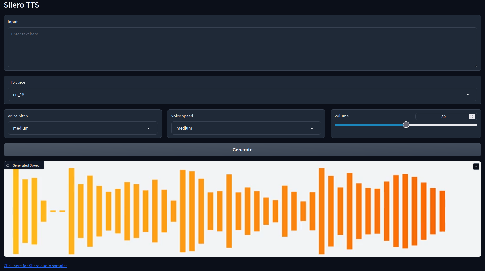

# Silero web UI
A browser interface based on Gradio library for  Silero TTS.



## Installation and Running

```
# Clone
git clone https://github.com/GhostNaN/silero-webui
cd silero-webui
# Create venv
python -m venv venv
source venv/bin/activate
# Install requirements
pip install -r requirements.txt
# Run app
python app.py
```
You can also run with the included 

## Acknowledgments
- Silero Models: https://github.com/snakers4/silero-models
- For the ```tts_preprocessor.py``` and some code in ```app.py```: https://github.com/oobabooga/text-generation-webui/tree/main/extensions/silero_tts
- For some other code in ```app.py```: https://github.com/facebookresearch/audiocraft
